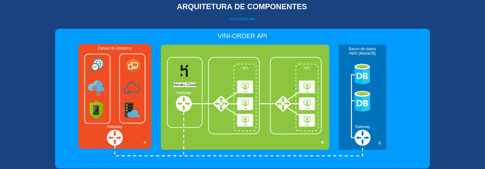
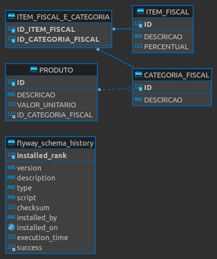

<h1 align="center">
  
</h1>
<h2 align="center">
  Vini-Order - API
</h2>

A ViniOrder-API é uma API Rest criada para fins acadêmicos e consultas posteriores. A API possui um Swagger disponibilizado na [Heroku](https://vini-order-api.herokuapp.com/swagger-ui.html).

    
    

---

## Índice

<ul>
  <li><a href="#funcionalidades-da-api">Funcionalidades da API</a></li>
  <li><a href="#mínimo-para-rodar">Mínimo para rodar</a></li>
  <li><a href="#mysql-ou-mariadb">Configurando banco de dados</a></li>
  <li><a href="#como-rodar-a-api">Como rodar a API?</a></li>
  <li><a href="#como-contribuir">Como contribuir?</a></li>
  <li><a href="#contato">Contato</a></li>
  <li><a href="#-license">License</a></li>
</ul>

---

## Funcionalidades da API

- [x] Busca paginada por produtos
- [x] Busca paginada por categorias
- [x] Consulta detalhada de produto
- [x] Consulta detalhada de categoria
- [x] Simulação de integração de pedido com totalização

---

## Mínimo para rodar

Para rodar o projeto, existem alguns requisítos mínimos de configurações, são eles:

- Java 17 **(Obrigatório)**
- MariaDB Server 10.5+ **(Obrigatório se não for rodar via docker)**
- Eclipse, STS ou qualquer IDE de sua preferência **(Obrigatório)**
- Docker **(Obrigatório se for rodar via script)

---

## MariaDB

Para que seja possível rodar a aplicação, faz-se necessário configurar previamente as informações de conexão no arquivo `application.properties` deste projeto.

Um setup inicial válido para uma base nova pode seguir os padrões abaixo:

- URL de conexão da base `spring.datasource.url=jdbc:mariadb://[SERVIDOR]:[PORTA]/[BASE]?user=[NOME_USUARIO]&password=[SENHA]&createDatabaseIfNotExist=TRUE`, o `createDatabaseIfNotExist=TRUE` faz com que o próprio framework crie a base de dados.

- No meu caso, a primeira linha do meu `application-dev.properties` fica `spring.datasource.url=jdbc:mariadb://localhost:3306/devdb?user=admin&password=123456dv&createDatabaseIfNotExist=TRUE`

---

## Como rodar a API?

### Usando o Eclipse ou STS
#### Passo 1

- 👯 Clone este repositório na sua máquina local usando `https://github.com/viniciosarodrigues/vini-order.git`

#### Passo 2

- ✅ Importe o projeto na sua IDE

#### Passo 3

- 🔃 Rode a aplicação com botão direito do mouse no projeto, `run as` > `Spring Boot App`. Também é possível rodar a aplicação à partir da classe `ApplicationMain` dentro do projeto, basca clicar com o botão direito na classe e seguir o mesmo fluxo.

#### Dica
Se você estiver usando o Eclipse, pode ser uma boa ideia baixar o plugin disponibilizado pela Pitoval no marketplace, o `Spring Tools 4 (release)`

---

## Como contribuir

### Passo 1

- 🍴 Realize um Fork deste respositório!

### Passo 2

- 👯 Clone este repositório na sua máquina local usando `https://github.com/viniciosarodrigues/vini-order.git`

### Passo 3

- 🎋 Crie sua branch de funcionalidade usando `git checkout -b minha-funcionalidade`

### Passo 4

- ✅ Realize o commit de suas alterações usando `git commit -m 'feat: Minha nova funcionalidade'`;

### Passo 5

- 📌 Realize o push para a branch usando `git push origin minha-funcionalidade`;

### Passo 6

- 🔃 Crie um novo pull request

Depois que seu Pull Request é aceito e o merge é realizado, você pode deletar a sua branch de funcionalidade.

---

## Arquitetura
Esta área especifica definições técnicas da aplicação, suas características e comportamentos.
### Diagrama de componentes

<h1 align="center">
  
</h1>

### Modelagem de dados

<h1 align="center">
  
</h1>

---

## Contato

> Você pode me encontrar por aqui...

- Vinícios Rodrigues :: [viniciosarodrigues@gmail.com](viniciosarodrigues@gmail.com)

---

## 📝 License

Este projeto é licenciado por MIT License - Veja a licença no arquivo [LICENSE](LICENSE) para mais detalhes.

---
